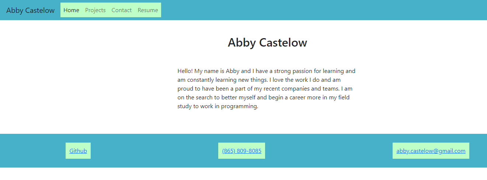

# 20 React: React Portfolio

## Your Task

Being a web developer means being part of a community. You’ll need a place not only to share your projects while you're applying for jobs or working as a freelancer but also to share your work with other developers and collaborate on projects.

My task was to create a portfolio using my new React skills, which will help set me apart from other developers whose portfolios don’t use the latest technologies.

I've deploy this application to GitHub Pages, following the instructions on this guide [Create React App Docs on GitHub Pages](https://create-react-app.dev/docs/deployment/#github-pages) to create a build that I can deploy.

## Deployed Example

The following animation shows the web application's appearance and functionality:

